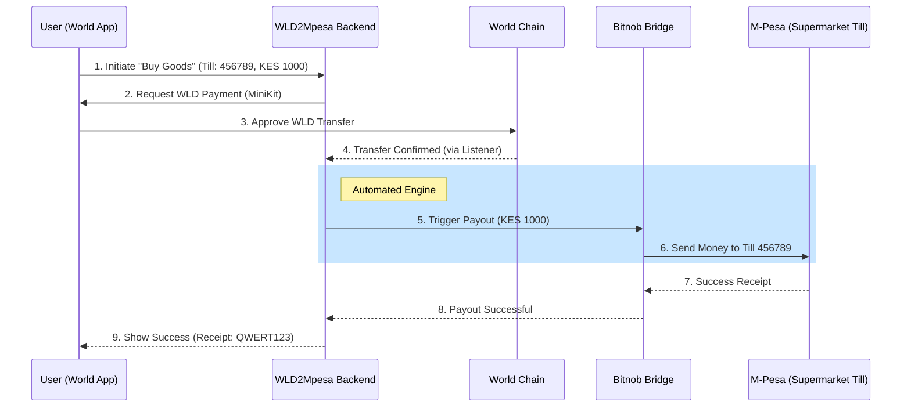

# Scenario: Paying a Supermarket Till Number

This scenario describes how a user pays for groceries at a supermarket using WLD directly from their World App.

## Detailed Flow

1.  **Checkout**: The user arrives at a checkout counter with a "Till Number" (e.g., `456789`).
2.  **App Input**: User opens the WLD2Mpesa Mini App, selects "Buy Goods," enters the Till Number and the KES amount.
3.  **Authentication**: Mini App prompts for World ID verification (human-check).
4.  **On-Chain Payment**: MiniKit executes the WLD transfer from the user's wallet to the platform.
5.  **Automated Off-ramp**:
    -   Backend detects the WLD transfer.
    -   Backend triggers **Bitnob** to send the equivalent KES to the supermarket's Till Number.
6.  **Confirmation**: The supermarket's Till system receives a standard M-Pesa confirmation. The Mini App shows "Payment Success."

## Sequence Diagram

## Tools & Services Relied Upon
-   **MiniKit**: For the bridge between World App and our UI.
-   **Bitnob**: For the B2B mobile money payout.
-   **Daraja (Fallback)**: If Bitnob's direct Till payout is unavailable, the backend uses Daraja to deliver the final KES.
