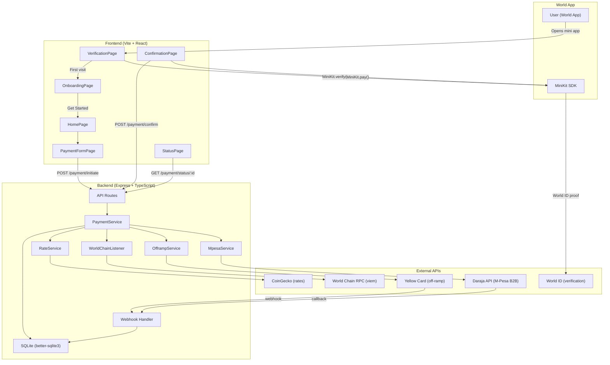
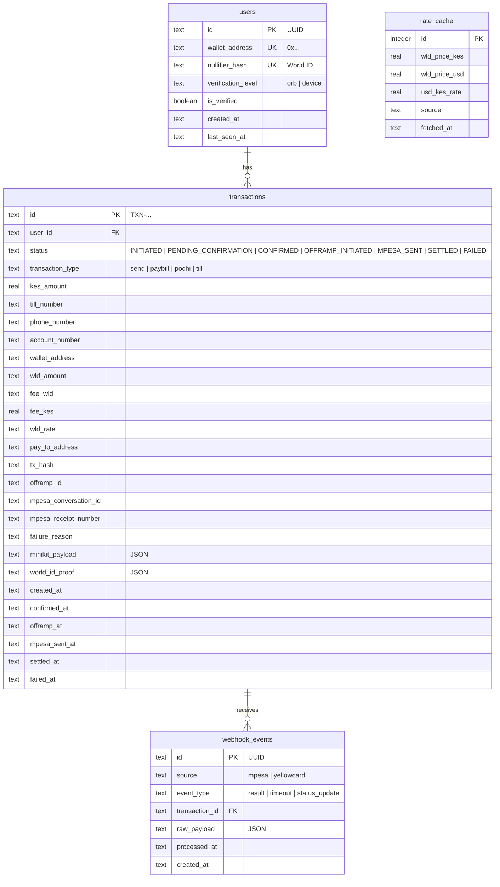

# WLD2Mpesa: Full Production Transition + Architecture

## System Architecture



---

Replace JSON file store ([transactionStore.ts](file:///home/jarhead/Documents/coDocs/minikit/wld-app-mini-app/wld2mpesa/backend/src/services/transactionStore.ts)) with **SQLite via Prisma ORM**.

### Why SQLite (not PostgreSQL)?
- Single-server deployment (Render/Railway) — no external DB needed
- Zero ops overhead, embedded in the process
- Prisma makes it trivial to migrate to PostgreSQL/Postgres-based providers later

### Schema



### Models (Prisma)

| Model | Table | Purpose |
|-------|-------|---------|
| `User` | `users` | Wallet address, World ID nullifier, verification status |
| [Transaction](file:///home/jarhead/Documents/coDocs/minikit/wld-app-mini-app/wld2mpesa/backend/src/types/index.ts#25-64) | `transactions` | Full payment lifecycle |
| `RateCache` | `rate_cache` | Cached exchange rates (avoid CoinGecko rate limits) |
| `WebhookEvent` | `webhook_events` | Audit trail for M-Pesa / Yellow Card async callbacks |

---

## User Review Required

> [!IMPORTANT]
> **Database Choice**: Using **SQLite** (embedded, zero-config) for production simplicity. If you anticipate multi-server deployment or need concurrent write performance, we should use **PostgreSQL** instead.

> [!WARNING]
> **Yellow Card API**: Off-ramp requires `YELLOW_CARD_API_KEY` + `YELLOW_CARD_SECRET`. Without them, the off-ramp flow will fail at runtime.

> [!CAUTION]
> **Real Money**: Once `SIMULATION_MODE=false`, all transactions involve real WLD and real KES.

---

## Proposed Changes

### Database Layer

#### [NEW] [prisma/schema.prisma](file:///home/jarhead/Documents/coDocs/minikit/wld-app-mini-app/wld2mpesa/backend/prisma/schema.prisma)
Prisma schema definitions for all 4 models (users, transactions, rate_cache, webhook_events)

#### [NEW] [src/db/prisma.ts](file:///home/jarhead/Documents/coDocs/minikit/wld-app-mini-app/wld2mpesa/backend/src/db/prisma.ts)
Database connection setup using `@prisma/client` and `@prisma/adapter-better-sqlite3`

#### [MODIFY] [transactionStore.ts](file:///home/jarhead/Documents/coDocs/minikit/wld-app-mini-app/wld2mpesa/backend/src/services/transactionStore.ts)
Replace JSON file implementation with Prisma Client queries. **Same public API** ([save](file:///home/jarhead/Documents/coDocs/minikit/wld-app-mini-app/wld2mpesa/backend/src/services/transactionStore.ts#79-84), [get](file:///home/jarhead/Documents/coDocs/minikit/wld-app-mini-app/wld2mpesa/backend/src/services/transactionStore.ts#85-89), [update](file:///home/jarhead/Documents/coDocs/minikit/wld-app-mini-app/wld2mpesa/backend/src/services/transactionStore.ts#90-97), [getAll](file:///home/jarhead/Documents/coDocs/minikit/wld-app-mini-app/wld2mpesa/backend/src/services/transactionStore.ts#98-105)) — all callers remain unchanged.

#### [NEW] [services/userStore.ts](file:///home/jarhead/Documents/coDocs/minikit/wld-app-mini-app/wld2mpesa/backend/src/services/userStore.ts)
User CRUD: `findByWallet()`, `findByNullifier()`, `createOrUpdate()`, `markVerified()`

#### [MODIFY] [types/index.ts](file:///home/jarhead/Documents/coDocs/minikit/wld-app-mini-app/wld2mpesa/backend/src/types/index.ts)
Add `User`, `RateCache`, `WebhookEvent` interfaces

---

### New User Entry Flow (Frontend)

#### [NEW] [VerificationPage.tsx](file:///home/jarhead/Documents/coDocs/minikit/wld-app-mini-app/wld2mpesa/frontend/src/pages/VerificationPage.tsx)
World ID verification + wallet active check on app entry

#### [NEW] [OnboardingPage.tsx](file:///home/jarhead/Documents/coDocs/minikit/wld-app-mini-app/wld2mpesa/frontend/src/pages/OnboardingPage.tsx)
5-slide animated wizard: Problem → How It Works → Security → Tech → Compliance

#### [MODIFY] [App.tsx](file:///home/jarhead/Documents/coDocs/minikit/wld-app-mini-app/wld2mpesa/frontend/src/App.tsx)
Add `verification` + `onboarding` screens, entry point → verification

#### [MODIFY] [paymentStore.ts](file:///home/jarhead/Documents/coDocs/minikit/wld-app-mini-app/wld2mpesa/frontend/src/stores/paymentStore.ts)
Add `walletAddress`, `worldIdVerified`, new screen types

#### [MODIFY] [minikit.ts](file:///home/jarhead/Documents/coDocs/minikit/wld-app-mini-app/wld2mpesa/frontend/src/lib/minikit.ts)
Export `getWalletAddress()`

---

### Backend Production Services

#### [MODIFY] [config.ts](file:///home/jarhead/Documents/coDocs/minikit/wld-app-mini-app/wld2mpesa/backend/src/config.ts)
Flip simulation default, add `WORLD_CHAIN_RPC_URL`, add `DATABASE_PATH`

#### [MODIFY] [rateService.ts](file:///home/jarhead/Documents/coDocs/minikit/wld-app-mini-app/wld2mpesa/backend/src/services/rateService.ts)
Uncomment CoinGecko fetch, add DB-backed rate cache

#### [MODIFY] [worldChainListener.ts](file:///home/jarhead/Documents/coDocs/minikit/wld-app-mini-app/wld2mpesa/backend/src/services/worldChainListener.ts)
Implement with `viem` — `waitForTransactionReceipt()` + Transfer log verification

#### [MODIFY] [offrampService.ts](file:///home/jarhead/Documents/coDocs/minikit/wld-app-mini-app/wld2mpesa/backend/src/services/offrampService.ts)
Uncomment Yellow Card HMAC-signed API calls

#### [MODIFY] [mpesaService.ts](file:///home/jarhead/Documents/coDocs/minikit/wld-app-mini-app/wld2mpesa/backend/src/services/mpesaService.ts)
Uncomment Daraja B2B OAuth + payment request

#### [MODIFY] [paymentService.ts](file:///home/jarhead/Documents/coDocs/minikit/wld-app-mini-app/wld2mpesa/backend/src/services/paymentService.ts)
Real pipeline using actual services, `markSettled()` / `markFailed()` for webhooks

#### [MODIFY] [payment.routes.ts](file:///home/jarhead/Documents/coDocs/minikit/wld-app-mini-app/wld2mpesa/backend/src/routes/payment.routes.ts)
MiniKit + World ID verification, `GET /history/:wallet` endpoint

#### [NEW] [webhooks.routes.ts](file:///home/jarhead/Documents/coDocs/minikit/wld-app-mini-app/wld2mpesa/backend/src/routes/webhooks.routes.ts)
M-Pesa + Yellow Card callback handlers, stores to `webhook_events` table

#### [MODIFY] [server.ts](file:///home/jarhead/Documents/coDocs/minikit/wld-app-mini-app/wld2mpesa/backend/src/server.ts)
`helmet()`, `express-rate-limit`, mount webhooks, DB init on startup

---

### Frontend Cleanup

#### [MODIFY] [PaymentFormPage.tsx](file:///home/jarhead/Documents/coDocs/minikit/wld-app-mini-app/wld2mpesa/frontend/src/pages/PaymentFormPage.tsx)
Use real wallet from store instead of `'0xSIMULATED_USER_WALLET'`

#### [MODIFY] [HomePage.tsx](file:///home/jarhead/Documents/coDocs/minikit/wld-app-mini-app/wld2mpesa/frontend/src/pages/HomePage.tsx)
Real transaction history from backend API

#### [MODIFY] [utils.ts](file:///home/jarhead/Documents/coDocs/minikit/wld-app-mini-app/wld2mpesa/frontend/src/lib/utils.ts)
Remove `DEMO_RATES`, [convertKesTo()](file:///home/jarhead/Documents/coDocs/minikit/wld-app-mini-app/wld2mpesa/frontend/src/lib/utils.ts#53-59)

#### [MODIFY] [api.ts](file:///home/jarhead/Documents/coDocs/minikit/wld-app-mini-app/wld2mpesa/frontend/src/lib/api.ts)
Add `fetchTransactionHistory(walletAddress)`

---

### Dependencies

```bash
# Backend
cd wld2mpesa/backend && npm install viem express-rate-limit helmet prisma @prisma/client @prisma/adapter-better-sqlite3 better-sqlite3
```

---

## Verification Plan

### Automated
```bash
cd wld2mpesa/backend && npx tsc --noEmit
cd wld2mpesa/frontend && npx tsc --noEmit
```

### Manual
1. Backend starts → SQLite DB auto-created at `data/wld2mpesa.db`
2. `GET /api/health` → `simulationMode: false`
3. `GET /api/rates/wld-kes` → live CoinGecko + cached in `rate_cache`
4. Browser → VerificationPage → "Open in World App" message
5. World App → verify → onboard → home → execute test payment
